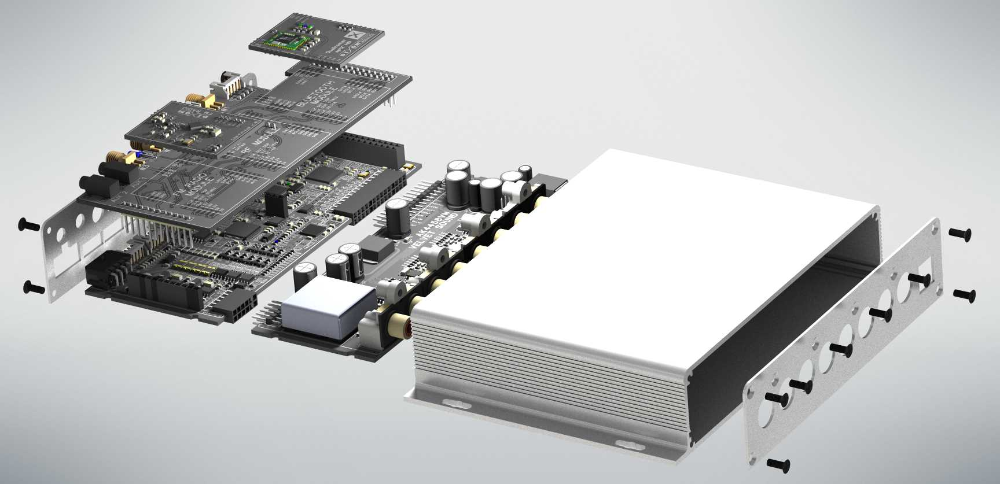
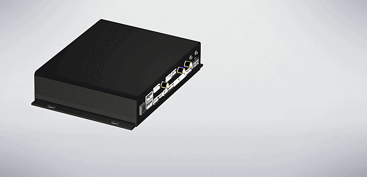

# Dixom-m  

## Цифровая модульная аудиоплатформа

  

**Dixom-m** — это цифровая модульная аудиоплатформа, предназначенная в первую очередь для построения **кастомных автомобильных аудиосистем и автомагнитол** на базе **Android-планшетов и Android-устройств**. Платформа ориентирована на энтузиастов, разработчиков и интеграторов, которым требуется гибкая, расширяемая и качественная аудиоархитектура.

---

## Назначение платформы

Основная цель Dixom-m — предоставить аппаратную основу для создания **нестандартных Android-магнитол**, превосходящих по возможностям и качеству звучания серийные решения.

Платформа позволяет:
- использовать Android-планшет в качестве головного устройства (UI, навигация, мультимедиа);
- вынести аудиотракт в отдельные специализированные модули;
- масштабировать систему под конкретные требования проекта.

---

## Ключевая концепция

Dixom-m построена по **модульному принципу**, где каждый функциональный блок реализован в виде отдельного аппаратного модуля. Это обеспечивает:

- гибкость конфигурации;
- упрощённую модернизацию;
- возможность кастомизации под конкретный автомобиль и аудиосистему.

---

## Основные возможности

### Цифровая обработка аудиосигнала
- работа с цифровыми аудиопотоками;
- минимизация потерь качества;
- возможность интеграции DSP-алгоритмов.

### Модульная архитектура
- отдельные модули для:
  - аудиовходов и выходов;
  - усиления;
  - управления питанием;
  - коммутации и интерфейсов;
- возможность добавления новых модулей без переработки всей системы.

### Интеграция с Android
- совместимость с Android-планшетами и Android-устройствами;
- использование Android как центрального интерфейса управления;
- поддержка кастомных приложений и сервисов.

### Автомобильная направленность
- рассчитана на работу в автомобильной среде;
- возможность интеграции с бортовой сетью автомобиля;
- ориентация на качественный автозвук (SQ / SQL / кастомные проекты).

---

## Области применения

- кастомные Android-магнитолы;
- DIY-автозвук и инсталляции;
- экспериментальные аудиопроекты;
- прототипирование цифровых аудиосистем;
- мультимедийные автомобильные комплексы.

---

## Преимущества

- полная кастомизация под конкретный проект;
- независимость от готовых коммерческих магнитол;
- возможность постепенного расширения системы;
- ориентация на высокое качество звука;
- открытость к доработкам и развитию.

---

## Статус проекта

Проект **Dixom-m** находится в стадии активной разработки и развития.  
Архитектура, аппаратные модули и программная часть могут изменяться и дополняться.

---

## Цель проекта

Создание универсальной, масштабируемой и качественной аппаратной платформы для построения **современных автомобильных аудиосистем нового поколения** на базе Android.
