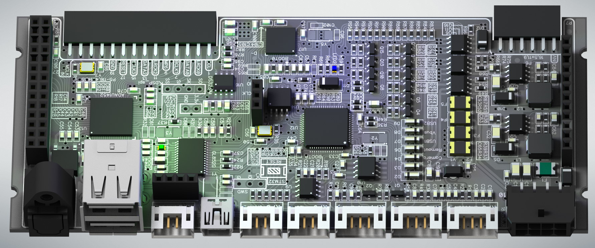
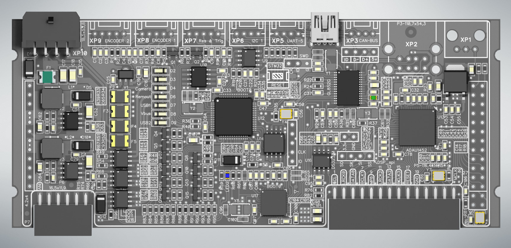

**Рисунок 1 — 3D модель платы Dixom-M Base**

Для корректной сборки и запуска платформы необходимо приобрести все электронные компоненты, перечисленные в таблице № 1.

Рекомендуется закладывать резерв по пассивным компонентам в корпусе SMD 0603 (конденсаторы и резисторы), поскольку из-за их малых габаритов существует повышенный риск утери или повреждения в процессе ручного монтажа.

Компоненты, выделенные в таблице красным цветом, являются опциональными и не подлежат установке на базовую плату, соответственно их приобретение не требуется.

<strong>Таблица 1 — Bill of Materials (BOM)</strong>

 

| № | RefDes | Наименование | Корпус / Тип | Кол-во | Выводы |
|---|--------|--------------|--------------|--------|--------|
| 1 | U9 | PCA82C250 | SOIC-8/150mil | 1 | 8 |
| 2 | U10 | 24LC256-I/SN | SOIC-8/150mil | 1 | 8 |
| 3 | U11 | GL852G-HHG12 | SOP-28/8.1x0.65 | 1 | 28 |
| 4 | U12 | STM32F405RGT6 | QFP-64/12x12x0.5 | 1 | 64 |
| 5 | U13 | ADAU1452WBCPZ | LFCSP-72 | 1 | 72 |
| 6 | U14 | W25Q80DVSSIG | SOIC-8/200mil | 1 | 8 |
| 7 | U15 | DS3231MZ | SOIC-8/150mil | 1 | 8 |
| 8 | U16 | STM32F411CEU6 | UFQFPN-48 (7x7) | 1 | 48 |
| 9 | V1 | HT7533-1 | SOT-89 | 1 | 3 |
|10 | V2, V3 | MP1584EN | SOIC-8EP/150mil | 2 | 8 |
|11 | D1, D5, D10–D12 | SS54B | SMB (DO-214AA) | 5 | 2 |
|12 | D2–D9 | LL4148 | LL-34 | 8 | 2 |
|13 | L1 | BCIHP0730-150M | IND 7×7×3 mm | 1 | 2 |
|14 | L2 | BCIHP0730-100M | IND 7×7×3 mm | 1 | 2 |
|15 | F1 | TLC-MSMD150/24 | 1812 | 1 | 2 |
|16 | F2 | TLC-MSMD110 | 1812 | 1 | 2 |
|17 | F3–F5 | TLC-MSMD110/24 | 1812 | 3 | 2 |
|18 | Q1, Q2, Q4, Q5, Q7–Q10, Q12–Q15 | BC817-40 | SOT-23 | 12 | 3 |
|19 | Q3 | STD2805T4 | DPAK-3 | 1 | 3 |
|20 | Q6, Q11, Q16 | AO4801 | SOIC-8/150mil | 3 | 8 |
|21 | Y4 | Q33310F70060700 (12 MHz) | SMD 3225-4P | 1 | 4 |
|22 | Y6 | SX7M24.576M20F30TNN | SMD 3225-4P | 1 | 4 |
|23 | Y7 | SX3M22.5792M20F30TNN | SMD 3225-4P | 1 | 4 |
|24 | LED1 | Зелёный светодиод | SMD 0603 | 1 | 2 |
|25 | LED2 | Синий светодиод | SMD 0603 | 1 | 2 |
|26 | C1, C2, C3, C5, C6, C7, C9, C10, C48, C53, C70, C80 | 10 nF | SMD 0603 | 12 | 2 |
|27 | C4, C8, C13, C19–C26, C28, C29, C33, C34, C37, C40, C42, C43, C45, C46, C49–C51, C54, C58, C59, C63, C64, C67, C71, C72, C74, C77–C79, C81, C85–C88, C91, C92, C94, C97, C103, C105 | 100 nF | SMD 0603 | 46 | 2 |
|28 | C14, C16, C30, C31, C62, C66, C84, C98, C101 | 22 µF 16 V | SMD 0805 | 9 | 2 |
|29 | C15, C22, C27, C35, C36, C44, C47, C55, C57, C68, C69, C73, C75, C76, C82, C89, C90, C95, C100, C104 | 1 µF | SMD 0603 | 20 | 2 |
|30 | C17, C18, C52, C83 | 22 µF 25 V | SMD 1206 | 4 | 2 |
|31 | C32 | 5.6 nF | SMD 0603 | 1 | 2 |
|32 | C41, C56, C65, C106 | 150 pF | SMD 0603 | 4 | 2 |
|33 | C93 | 220 pF | SMD 0603 | 1 | 2 |
|34 | R1, R3, R5, R7, R9, R10, R12, R21, R29, R41, R43, R44, R46, R48–R50, R54, R55, R57, R68, R70, R72, R74, R75, R77, R79, R96 | 10 kΩ | SMD 0603 | 27 | 2 |
|35 | R2, R4, R6, R8, R12–R16, R19, R20, R23, R24, R26, R35, R37, R42, R45, R47, R56, R58, R61, R71, R73, R78, R80, R81, R83–R88, R91, R97 | 100 Ω | SMD 0603 | 36 | 2 |
|36 | R11 | 120 Ω | SMD 0603 | 1 | 2 |
|37 | R17, R18, R76, R82, R90, R93, R95 | 2.2 kΩ | SMD 0603 | 7 | 2 |
|38 | R22, R25, R28, R36, R40, R53, R59, R60, R63, R64 | 1 kΩ | SMD 0603 | 10 | 2 |
|39 | R27 | 4.3 kΩ | SMD 0603 | 1 | 2 |
|40 | R33 | 20 kΩ | SMD 0603 | 1 | 2 |
|41 | R34 | 100 kΩ | SMD 0603 | 1 | 2 |
|42 | R38, R66 | 200 kΩ | SMD 0603 | 2 | 2 |
|43 | R39 | 3.9 kΩ | SMD 0603 | 1 | 2 |
|44 | R51 | 47 kΩ | SMD 0603 | 1 | 2 |
|45 | R52 | 68 kΩ | SMD 0603 | 1 | 2 |
|46 | R67, R89, R92, R94 | 15 kΩ | SMD 0603 | 4 | 2 |
|47 | CON1, CON2 | DS1023-2×14SF11 | P=2.54 mm | 2 | 28 |
|48 | CON6 | A2541HWV-3P | P=2.54 mm | 1 | 3 |
|49 | CON7 | C36191 | P=2.54 mm | 1 | 12 |
|50 | CON8 | A2541HWV-12P | P=2.54 mm | 1 | 12 |
|51 | CON9 | A2541HWV-4P | P=2.54 mm | 1 | 4 |
|52 | XP1 | PLR135/T9 | Through Hole | 1 | 3 |
|53 | XP2 | 907-112A1012D10200 | Plugin | 1 | 8 |
|54 | XP3, XP5, XP6 | S4B-PH-K-S | Push-Pull, P=2 mm | 3 | 4 |
|55 | XP4 | 920-462A2021D10102 | Plugin | 1 | 5 |
|56 | XP7–XP9 | S5B-PH-K-S | Push-Pull, P=2 mm | 1 | 5 |
|57 | XP10 | 43045-1200 | Micro-Fit | 1 | 8 |

Базовая плата аудио платформы Dixom-m выполнена на четырёхслойной печатной плате: верхний слой, два внутренних и нижний. Конструкция платы предусматривает размещение всех компонентов исключительно на верхней стороне, что значительно упрощает монтаж и последующую отладку устройства.

# Этапы сборки базовой платы аудио платформы Dixom-m

Процесс сборки базовой платы необходимо разделить на четыре этапа:

### Этап A — Монтаж и тестирование источников питания
- Необходимы напряжения **+3.3 В** и **+5 В**.
- Используются DC-DC преобразователи **MP1584EN** с регулировкой через сопротивления.
- Важно избегать повышения напряжения на линиях из-за ошибок или бракованных компонентов.
- Соберите и настройте источники питания.
- Проверьте стабильность +3.3 В и +5.0 В при входе 9–20 В.

### Этап B — Монтаж микросхем, микроконтроллеров и SMD-компонентов
### Этап C — Загрузка прошивок в микроконтроллеры
### Этап D — Комплексное тестирование собранной платы.
---

> **Важно:**  
> Устанавливать разъёмы и соединители следует только после успешного тестирования.  
> Ранний монтаж может осложнить замену неисправных компонентов во время отладки.

## A. Монтаж и тестирование источников питания

Для сборки DC-DC источников питания необходимы компоненты, перечисленные в таблице №2.  
На рисунке ниже зелёной областью схематически показано расположение этих компонентов.

Для подачи питания необходимо припаять системный разъём **XP10**.

Компоненты, выделенные красной зоной, на данном этапе устанавливать не нужно,  
за исключением резистора **R59** (SMD 0603, 1 кОм), который находится в красной зоне,  
он необходим для запуска DC-DC преобразователей.

После загрузки прошивки запуском и остановкой источников питания будет управлять микроконтроллер.

**Рисунок 2 — Пайка источников питания**

Для удобства ниже приведён список компонентов источников питания (эти позиции также присутствуют в Таблице 1).

<strong>Таблица компонентов источника питания</strong>

 

| №  | Обозначение        | Наименование               | Корпус        | Кол-во | Выводы |
|-----|--------------------|----------------------------|---------------|--------|--------|
| 1   | V1                 | HT7533-1                   | SOT89         | 1      | 3      |
| 2   | V2, V3             | MP1584EN                   | SOIC-8EP/150mil | 2      | 8      |
| 3   | D1, D5, D10        | SS54B                      | SMB(DO-214AA) | 3      | 2      |
| 4   | L1                 | BCIHP0730-150M             | IND 7*7*3mm   | 1      | 2      |
| 5   | L2                 | BCIHP0730-100M             | IND 7*7*3mm   | 1      | 2      |
| 6   | F1                 | TLC-MSMD150/24 (24V 1.5A) | 1812          | 1      | 2      |
| 7   | C19, C25, C51, C63, C79, C92 | 100nF           | SMD 0603      | 6      | 2      |
| 8   | C16, C62, C84      | 22uF 16V                   | SMD 0805      | 2      | 2      |
| 9   | C15                | 1uF                        | SMD 0603      | 1      | 2      |
| 10  | C65                | 150pF                      | SMD 0603      | 1      | 2      |
| 11  | C17, C18, C52, C83 | 22uF 25V                   | SMD 1206      | 4      | 2      |
| 12  | C93                | 220pF                      | SMD 0603      | 1      | 2      |
| 13  | R17, R18, R76, R82, R90, R93, R95 | 2.2kOm        | SMD 0603      | 7      | 2      |
| 14  | R22, R25, R28, R36, R40, R53, R59, R60, R63, R64 | 1kOm | SMD 0603      | 10     | 2      |
| 15  | R33                | 20kOm                      | SMD 0603      | 1      | 2      |
| 16  | R34                | 100kOm                     | SMD 0603      | 1      | 2      |
| 17  | R38, R66           | 200kOm                     | SMD 0603      | 2      | 2      |
| 18  | R39                | 3.9kOm                     | SMD 0603      | 1      | 2      |
| 19  | R51                | 47kOm                      | SMD 0603      | 1      | 2      |
| 20  | R52                | 68kOm                      | SMD 0603      | 1      | 2      |
| 21  | R67                | 15kOm                      | SMD 0603      | 4      | 2      |
| 22  | XP10               | 43045-1200                 | Micro Fit     | 1      | 8      |

После завершения монтажа компонентов подайте напряжение в диапазоне от 9 до 20 В.  
Рекомендуется использовать лабораторный источник питания и проверить стабильность выходных напряжений по всему диапазону входных значений.

В первую очередь измерьте напряжение на конденсаторе **C16** — оно должно быть ровно **+3.3 В**.

Далее проверьте наличие напряжения на разъёме **CON2**. Здесь должны присутствовать напряжения **+3.3 В** и **+5.0 В**.  
Допустимые отклонения:  
- для +3.3 В — от 3.1 В до 3.4 В  
- для +5.0 В — от 4.7 В до 5.2 В  

Если напряжения выходят за эти пределы, необходимо найти и устранить причину.

Если на выходе DC-DC модулей (разъём CON2) напряжение отсутствует, проверьте наличие +3.3 В на резисторе **R59** с обеих сторон — он отвечает за включение преобразователей.  
Если напряжение на резисторе есть, проведите дополнительные проверки цепей вокруг микросхем MP1584 для выявления причины неисправности.

**Рисунок 3 — Тестирование источников питания**

## B. Монтаж микросхем, микроконтроллеров и SMD-компонентов

После тщательной проверки всех напряжений и подтверждения их соответствия требованиям, можно приступать к монтажу остальных SMD-компонентов.

Ниже представлена схема расположения компонентов, а в таблице №1 — список компонентов с их позициями.  
В таблице компоненты, которые на данном этапе устанавливать не нужно, выделены красным цветом.  

Для удобства поиска компонентов в таблице доступен фильтр.

**Рисунок 4 — Слой с компонентами**
На данном этапе рекомендуется установить только минимальное количество разъёмов:  
основной разъём питания, MiniUSB-разъём и два соединителя — **CON2** и **CON7** для подключения ЦАП.  

Такой подход обусловлен тем, что при возникновении неисправностей в процессе загрузки прошивок и тестирования перепайка компонентов может занять много времени и потребовать усилий.  
Кроме того, использование паяльного фена повышает риск повреждения разъёмов и соединителей.

Ниже приведён рисунок, иллюстрирующий внешний вид печатной платы на данном этапе.

**Рисунок 5 — Плата без разъёмов**

## С Загрузка прошивок в микроконтроллеры и обновление

Для полноценной работы аудио платформы необходимо загрузить две прошивки:  
- одну в звуковую карту **STM32F411CEU6**,  
- вторую — в базовый микроконтроллер **STM32F405RGT6**.  

Существует два способа загрузки прошивок:  
1. Без программатора — через USB-кабель.  
2. С использованием программатора **ST-Link V2**, подключаясь к портам программирования SWD.

Для загрузки прошивок необходимо скачать соответствующие программы и файлы:  
- **Sound Bootloader** — включает загрузчик и основную прошивку звуковой карты.  
- **Base Bootloader** — содержит только загрузчик основного контроллера.

Чтобы загрузить основную прошивку:  
1. Сначала загрузите загрузчик в микроконтроллер **STM32F405RGT6**.  
2. Подключите аудио платформу к компьютеру через USB-кабель.  
3. Запустите программу **DixomPM**.  
4. Перейдите на вкладку **«Информация»**, нажмите кнопку **«Проверить наличие обновлений»** и загрузите обновление.  

> Для обновления требуется подключение к интернету.

